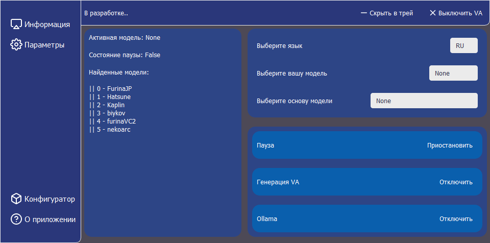

# Голосовой ассистент Фея



Проект использует способ генерации речи TTS из [RVC-tts-webui](https://github.com/litagin02/rvc-tts-webui)

Только в разработке, много функций отсутствуют, возможности:
* Открытие найденных, утвержденных программ (точность совпадений 60-70%)
* Открытие браузера и заготовленных ссылок из файла
* Управление окнами активных приложений (точность совпадений ~75%)
* Использование любой локальной модели от Ollama для генерации ответов (необходимо установить модель)
* Уточнит время, погоду, дату (для погоды стоит указать настройки OpenWeatherMap)
* Не привязан к имени, можно задать любое имя, главное легко произносимое
* Сохранение контекста разговора до 8 запросов (настраивается)

Распознает только русский язык хоть и присутствует локализация приложения

На фоне с играми, вероятно генерировать текст и голос не сможет (llama3.1 8b кушает 5GB видеопамяти), однако можно отключить эту функцию и просто оставить ассистента для остальных задач.

В планах:
* Улучшить дизайн
* Добавить локализацию на английский для ассистента
* Улучшить алгоритмы (мне нужно учится..)

Я считаю что задача минимум сделана, начал этот проект в конце августа 2024. Буду улучшать и потихоньку доделывать цели из плана, возможно добавлять новое.

# Установка

Тестировалось на Python 3.10 и pip 21.3.1 на Windows 11, работоспособность на этих версиях гарантирована.

### Видеокарта от NVIDIA 

Если ваша видеокарта выпущена компанией NVIDIA, то вам нужно установить:
* Microsoft C++ Build Tools: [Download installer](https://visualstudio.microsoft.com/ru/thank-you-downloading-visual-studio/?sku=BuildTools&rel=16).
* CUDA: [Download installer](https://developer.nvidia.com/cuda-12-4-0-download-archive?target_os=Windows&target_arch=x86_64)

### Установка в директории проекта

Открываем cmd в нужном месте и переходим в консоль по вашей директории.
```shell
git clone https://github.com/youshika-ypite/Fairy-VA.git
```
```shell
curl -L -O https://huggingface.co/lj1995/VoiceConversionWebUI/resolve/main/hubert_base.pt
```
```shell
curl -L -O https://huggingface.co/lj1995/VoiceConversionWebUI/resolve/main/rmvpe.pt
```
```shell
py -3.10 -m venv venv
venv\Scripts\activate
```
Если видеокарта NVIDIA, устанавливаем
```shell
pip install torch torchvision torchaudio --index-url https://download.pytorch.org/whl/cu124
```
```shell
pip install -r requirements.txt
```
## Установка Llama

Можно взять не только ламу, главное чтобы от [Ollama](https://ollama.com/)
```shell
# После установки ollama
ollama run llama3.1:8b #(Пример с маленькой версией на 5гб)
```
У меня 32gb ОЗУ и 6gb видеопамяти, использую 8B версию.

## Расположение моделей

Расположите ваши модели в соответствии с этой схемой:
weights
├── model1
│   ├── my_model1.pth
│   └── my_index_file_for_model1.index
└── model2
    ├── my_model2.pth
    └── my_index_file_for_model2.index
Каждый каталог модели должен содержать ровно один файл .pth и не более одного файла .index. Имя директории
используется как имя модели.

Возникло впечатление, что в путях с не ASCII символами (например, weights/モデル1/index.index) происходят
ошибки faiss. Поэтому, пожалуйста, избегайте их.

## Запуск 

* Переместите или скопируйте все .json файлы из configs/default в configs/

Важно! чтобы все работало обязательно сделайте следующее:
1. В `llama.json` укажите имя модели которую установили, например "llama3.1" (Стоит по умолчанию)
2. Если вы хотите добавить свой именной триггер то в файле `settings.json` рядом с "фея" через запятую укажите свой триггер. С маленькой буквы и кавычками `""`
---
*. Запустите скрипт start.bat

Если модули не устанавливаются убедитесь что у вас включено venv и используется правильная версия pip и python
```shell
pip --version
# Должно быть python 3.10 и pip 21.3.1
```

## Донат

Поддержать меня можно здесь - [Boosty](https://boosty.to/ypite/donate)